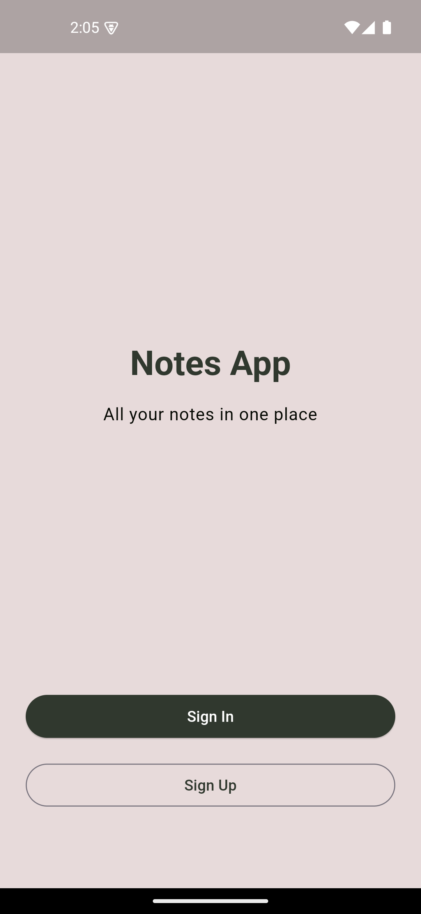
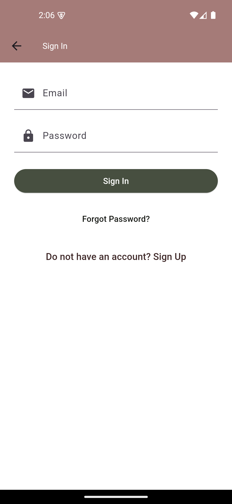
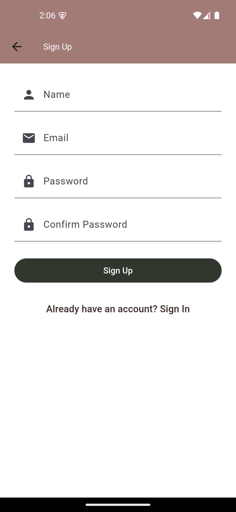
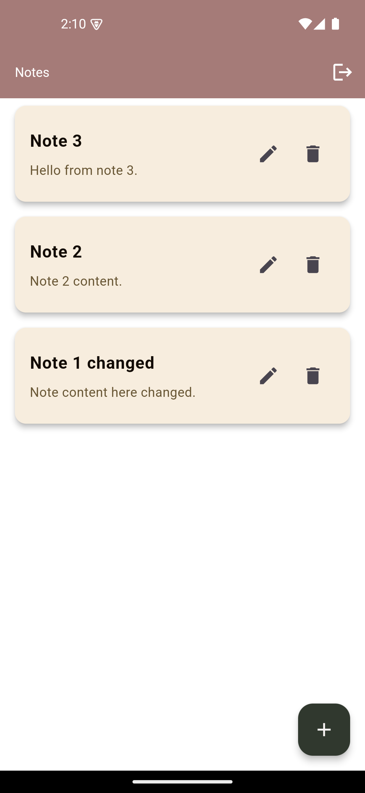
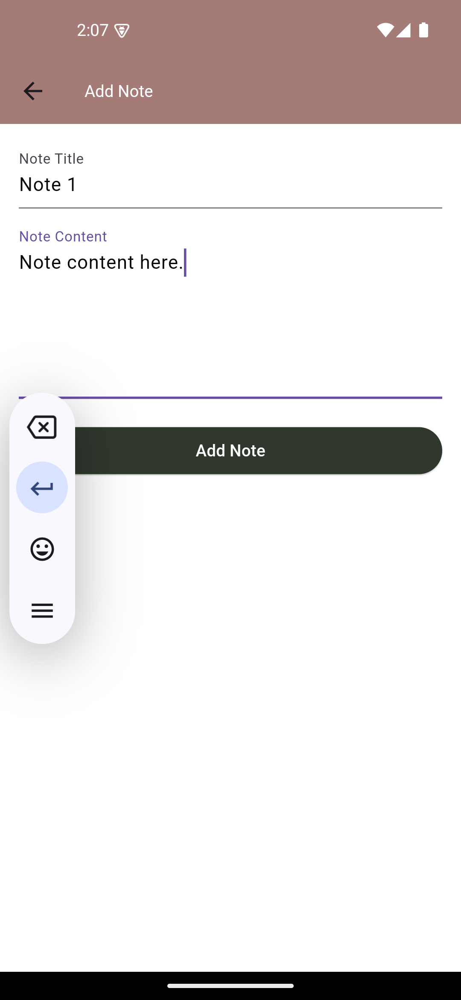
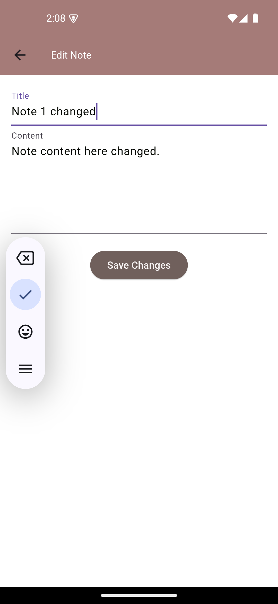

# Notes management app in Flutter
## Description
This is a simple notes management app built with Flutter. It allows users to create, read, update and delete notes, it also allows user authentication using firebase.
## Features
- User authentication using Firebase
- Create, read, update and delete notes
## Demo

## Screenshots
Welcome Screen

Login Screen

Sign Up Screen

Home Screen

Add Note Screen

Edit Note Screen

## How to install
### Prerequisites
- Flutter SDK installed.
- Compatible IDE (e.g., Android Studio, VS Code).
- Emulator or physical device for testing.
### App Instalation steps
1. Clone the repository
`git clone https://github.com/Bochra21/BochraDahmen_Task3.git`
2. Navigate to project root
`cd miniprojet`
3. Run `flutter pub get` to get the dependencies
4. Run `flutter run` to start the app

